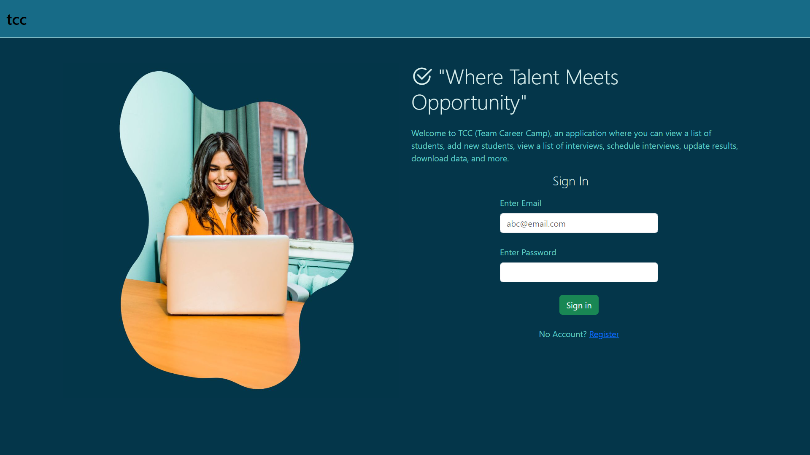
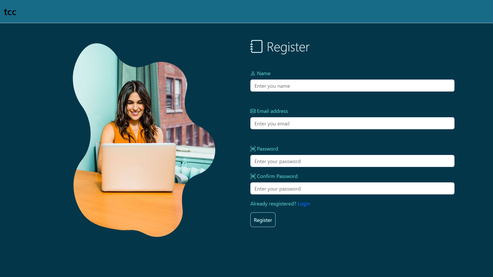
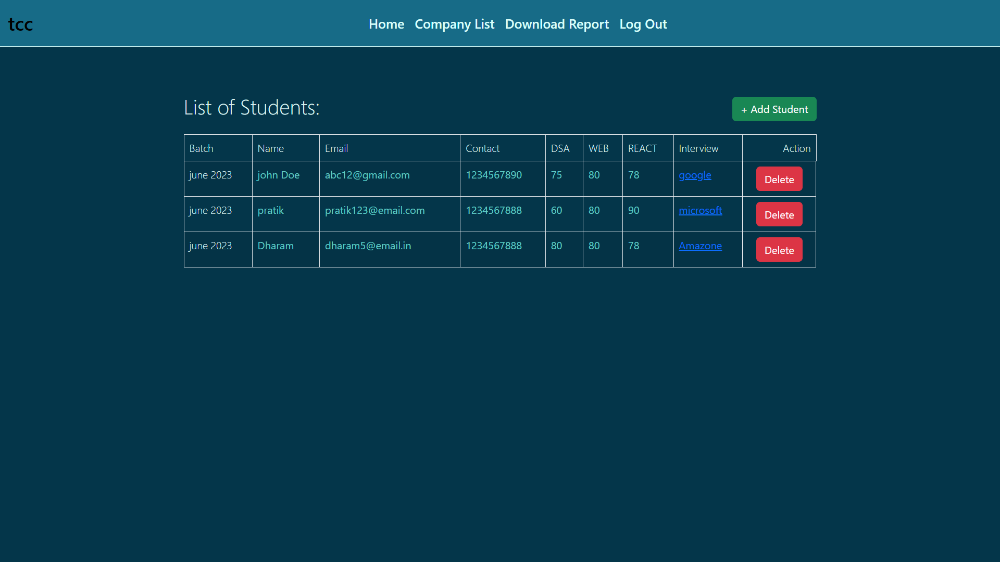
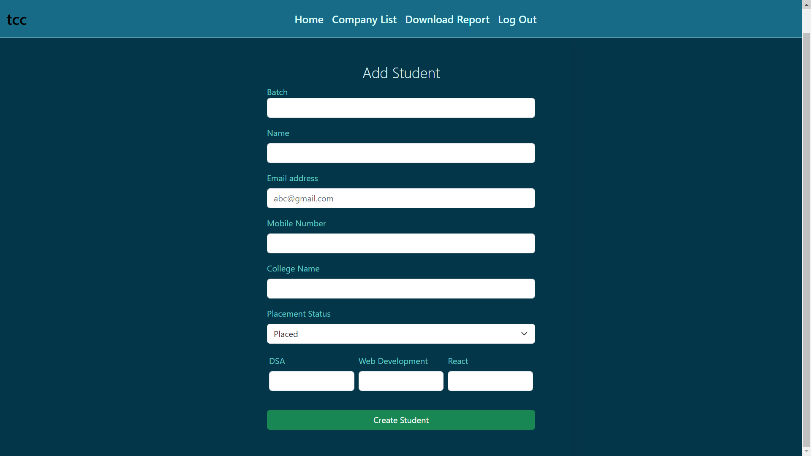
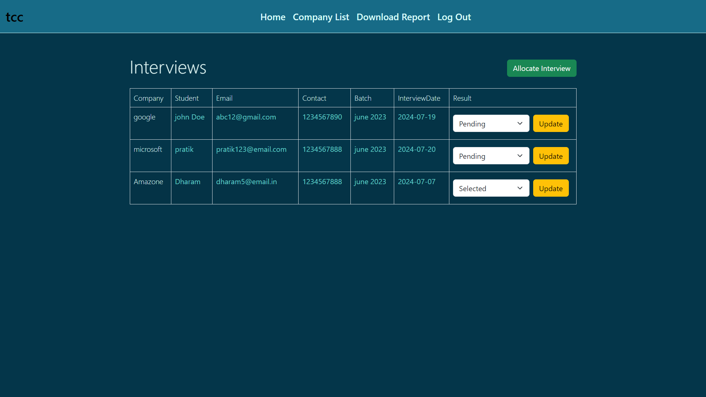
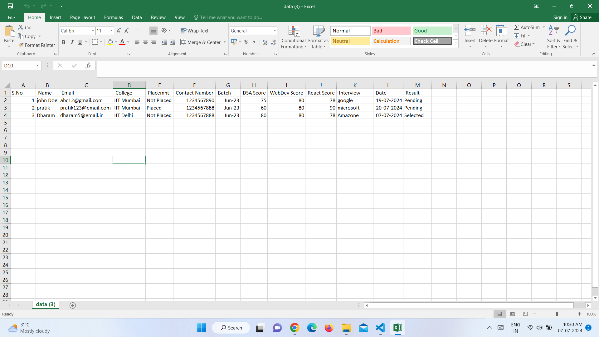

# 𝐏𝐥𝐚𝐜𝐞𝐦𝐞𝐧𝐭 𝐂𝐞𝐥𝐥 𝐀𝐩𝐩𝐥𝐢𝐜𝐚𝐭𝐢𝐨𝐧 🚀

 

Welcome to the Placement Cell application, designed for employees to manage students and interviews.  

## ⭐ Introduction

The Placement Cell Application is a Full Stack Application built using MongoDB, ExpressJS, NodeJS, EJS, express-ejs-layouts,mongoose & passport implements MVC projects with cloud MongoDB.This project is basically used for the purpose of assigning students to the interview slots of the incoming companies for the visit, at the backend for the employees to work. It manages both student & interview information along with the company visits.
This website is only restricted for the use of employees.

## Features
-  Employee can create an account or signup. Employee can login using the credentials.
-  Employee can create students in the student's section using the form.
-  Employee can create companies that are visiting in the interviews's section using the form.
-  Student's List contains students with the student data along with the list of assigned interviews.
-  Company's List contains companies with the list of students in the assigned interview slots along with the results.
-  Employee can add empty interview slots in a company, assign students to the interview slots along with the results, delete the empty interview slots, delete the student from the interview slot, edit & update the student's interview result.
-  Employee can downloads the student report with all the details into your system in csv format.

# Technologies Used

* HTML 
* CSS
* JavaScript
* Bootstrap (v5.3.2)
* Node.js
* Express
* npm
* MongoDB
* vscode
* mongoose

## File Structure
- 📁 **config/** - Contains all configuration files, such as mongoose settings, passport-local-strategy setup, and environment variables.
- 📁 **controllers/** - Contains all the controller files, including companyController, homeController, studentController, and userController.
- 📁 **models/** - Contains all the model/Schema files, including companySchema, studentSchema, and userSchema.
- 📁 **public/** - Contains static files served to the client.
- │   ├── 📂 **images/** - Stores image files used in the application.
- │   └── 📂 **styles/** - Contains CSS stylesheets for the application.
- 📁 **report/** - Stores data in CSV format for download when required.
- 📁 **routes/** - Contains route files for different entities: `companyRoutes`, `index`, `studentRoutes`, and `userRoutes`.
- 📁 **views/** - Contains EJS files used to provide various views to the EJS view engine.

## 🔥 Getting Started With The Project

-  Fork the Project in your Repository.
-  Clone the Forked Repository in your Local System.
-  Install & Configure - NodeJS & MongoDB.
-  Create '.env' file & Set the Environment Variables in it.
-  Run 'npm install' in GitBash Terminal
-  Run 'node index.js' in terminal to launch the project and get connect with the database.
-  Enjoy :)

## Screenshots

## Contributing
Feel free to contribute to this project by creating issues or submitting pull requests. Your contributions are welcome!
## Demo

link for trial is:
[https://github.com/sahejadkadivar]( write link after deployment)

## Authors

- [sahejadkadivar](https://github.com/sahejadkadivar)

## Follow Me:

> [LinkedIn](https://www.linkedin.com/in/sahejad-kadivar-667bb9227/)

I hope you like the project. Thanks for reading :)

